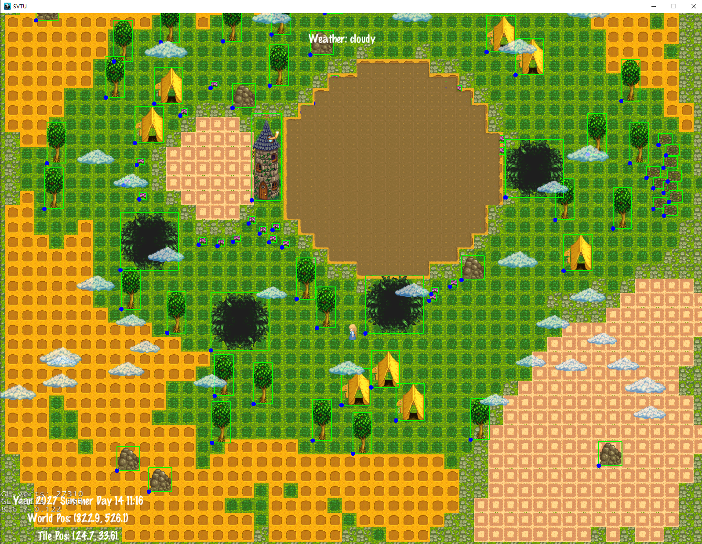
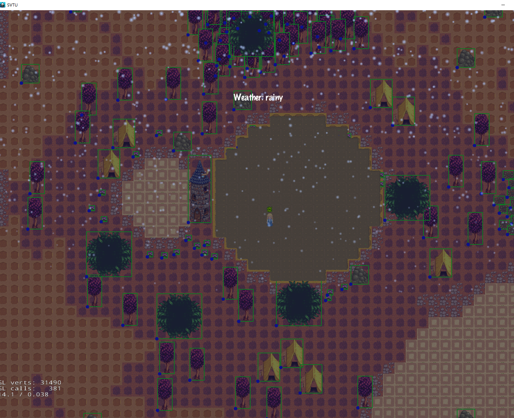
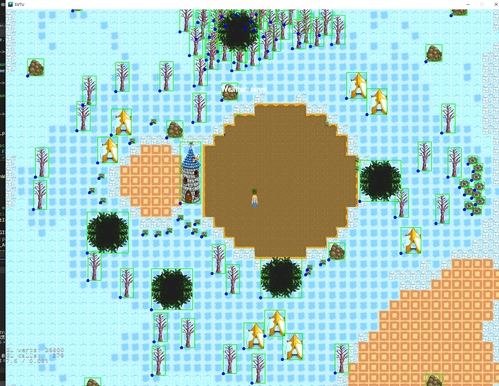
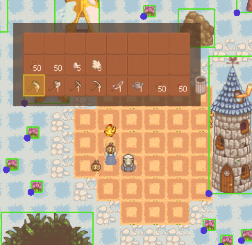
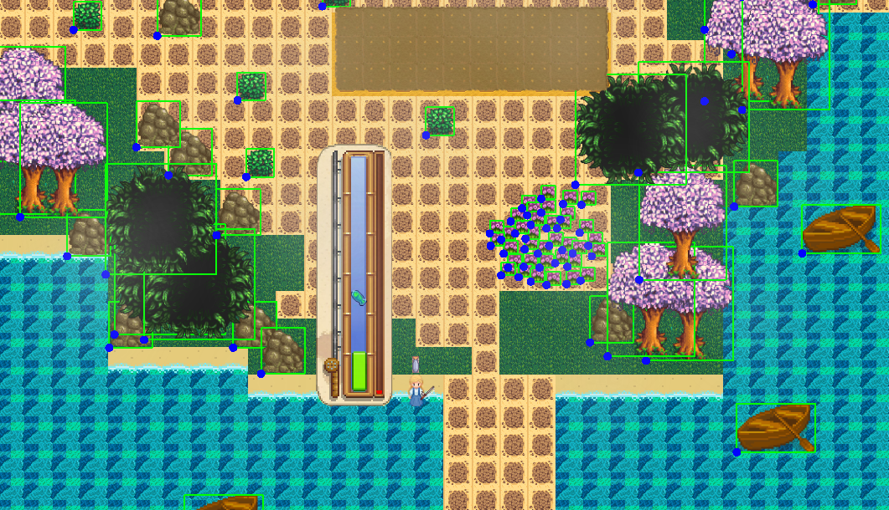
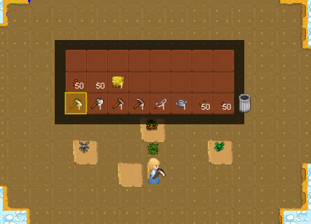
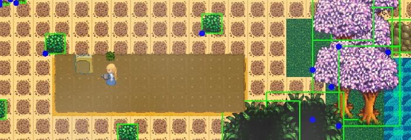

# README - 星露谷使用与操作指南

## 1. 简介

`FarmScene` 是本游戏/项目的**主要农场场景**，包含了：

- 地图渲染与管理
- 玩家角色的初始化和移动
- 耕地及作物管理
- 时间与天气系统
- 物品、背包交互
- 养殖系统（动物的生成与交互）
- 钓鱼系统（在水边可以钓鱼）

该场景基于 [Cocos2d-x v3.17](https://cocos2d-x.org/)（含物理引擎调试模式）的架构开发，演示了如何将多个子系统（TimeSeasonSystem、WeatherSystem、CropManager 等）整合在一个统一的场景下运行。

提供了两种不同类型的农场：岛屿农场和标准农场，每一个农场都有四季。

（标准农场的夏季，多云天气，调试模式，左下角为时间坐标信息）



（标准农场的秋季，下雨天气，调试模式，左下角为时间坐标信息）



（标准农场的冬季，晴朗天气，调试模式，左下角为时间坐标信息）



------


## 2. 主要功能

1. **地图管理**：加载指定类型的 TMX 地图，并根据季节动态渲染。
2. **时间与天气**：通过 TimeSeasonSystem & WeatherSystem，周期性改变天气与季节，并对农场环境造成影响。
3. **耕地与作物**：可以在农场中找到可耕地块，翻地/浇水/种植作物，并收获成熟的农作物。
4. **玩家控制**：支持键盘移动、背包操作以及对农场对象（地块、动物、物品）的交互。
5. **养殖系统**：可以在地图上生成鸡、羊等动物，并与其进行互动或获取产物。
6. **钓鱼系统**：可以在水边钓鱼。

------

## 3. 初始化流程

在游戏（或应用）启动时，调用：

```cpp
auto scene = FarmScene::createScene("default_map_type"); 
Director::getInstance()->runWithScene(scene);
```

其中 `"default_map_type"` 可以替换成需要加载的地图名称。
 在 `FarmScene::init(...)` 中，会按照以下顺序初始化各系统：

1. **物理世界**：设置 debug 绘制、重力为零等。
2. **TimeSystem & WeatherSystem**：时间、季节、天气系统初始化并添加到场景。
3. **FarmMapManager**：加载 TMX 地图，并初始化 `tmxMap`。
4. **地图、玩家**：完成地图渲染，初始化玩家（位置、物理碰撞、相机跟随）。
5. **Keyboard & Inventory**：设置键盘监听，初始化背包，生成工具/种子道具。
6. **FarmlandManager & CropManager**：扫描可种植地块并创建耕地层；创建作物管理层。
7. **各系统交互**：设置定时调度器更新天气、时间、交互等。

------

## 4. 场景结构说明

- **tmxMap**：主游戏地图，由 FarmMapManager 管理
- **player (User)**：玩家角色，可移动、执行动作
- **FarmlandManager**：负责管理所有耕地块（翻地、浇水等操作）
- **CropManager**：负责在耕地上种植/收获作物
- **TimeSeasonSystem**：游戏内时间与季节的核心管理
- **WeatherSystem**：控制当前天气（晴、雨、雪、雾等）
- **WeatherEffectManager**：渲染天气特效（雨、雪等）
- **Inventory / 背包**：玩家可携带工具、种子、收获物品等
- **InteractionManager**：管理玩家与地图、玩家与动物的互动

------

## 5. 键盘操作说明

### 移动

- **W / 上箭头**：向上移动
- **S / 下箭头**：向下移动
- **A / 左箭头**：向左移动
- **D / 右箭头**：向右移动

移动时，场景相机会自动跟随玩家。

### 背包与物品

- E：打开/关闭背包（Inventory）
  - 背包打开后，可使用方向键（WASD/上下左右）在物品槽间导航
  - **Space** 确认选中物品槽
  - **L** 丢弃当前选中的物品至“垃圾桶”槽位（示例逻辑）

### 耕地/作物（F键 + 对应工具）

- F：对玩家面前的一格地块执行操作，操作内容取决于当前选中工具或种子
  - 例：
    - 选中 **Hoe** 并按 **F**：对前方格子执行翻地
    - 选中 **Kettle** 并按 **F**：浇水
    - 选中 **Seed** 并按 **F**：若可播种，则种下该作物
    - 选中 **Reap** 并按 **F**：若前方有成熟作物，可收割并放进背包

### 其它

- **R**：减少选中物品堆叠数量 1
- **N**：切换另一种背包 UI（示例功能）
- **G**：在玩家附近拾取地面物品（范围默认为 50 像素）

------

## 6. 耕地与作物相关操作

1. **翻地 (Hoe)**：
   - 选中 “Hoe” 工具栏 -> 面朝要翻的地块 -> 按 **F**
   - 该地块变为 TILLED 状态
2. **浇水 (Kettle)**：
   - 选中 “Kettle” 工具栏 -> 面朝要浇的地块 -> 按 **F**
   - 该地块变为 WATERED 状态
3. **播种 (Seed)**：
   - 背包中有对应 “Berry Seed” / “Carrot Seed” / “Pepper Seed” / “Wheat Seed” 等
   - 选中种子 -> 面朝已翻地(或可种植)的地块 -> 按 **F**
   - 成功后，会在该地块生成对应的作物（SEED 状态贴图）
4. **收割 (Reap)**
   - 当作物到达 STAGE3（成熟）后，可以收割
   - 选中 “Reap” 工具 -> 面朝成熟作物 -> 按 **F**
   - 作物消失并加入背包（此处示例给背包新增一个 `CropItem`）

------

## 7. 物品与背包

- **打开背包 (E)**：显示物品栏 UI，可通过 **WASD / 方向键** 在 3x8 格子中移动选中槽位。
- **选中物品 (Space)**：确认选择背包槽位中的物品，使之成为“当前工具/种子”。
- **丢弃物品 (L)**：在背包打开状态下，按 L 将选中物品丢入垃圾槽。
- **使用物品 (F)**：合上背包后，面向一个方向按 F，可进行对应的工具/种子操作。
- **拾取物品 (G)**：玩家附近若有可拾取的 Item（比如地上掉落的作物、动物产物等），按 G 自动拾取。

------

## 8. 养殖系统

1. **创建动物**
   - 按 **C**：在玩家左侧生成一只鸡
   - 按 **V**：在玩家左侧生成一只羊
2. **与动物互动**
   - 按 **M**：与玩家 50 像素范围内的动物交互（喂食、产物收集等）
3. **收集产物**
   - 部分动物会自动产出蛋/羊毛等，通过 `player->pickupNearbyItems(...)` 或按 **G** 拾取到背包。



## 9. 钓鱼系统



* 在可以钓鱼的地方按下左键打开钓鱼界面。（记得拿鱼竿）
* 按空格控制钓鱼，可能会钓上来垃圾。

## 10. 天气与时间

1. TimeSeasonSystem
   - 负责控制游戏时间推进，每天、每小时的流逝
   - 当季节变化时，会回调 `onSeasonChanged(...)`，自动刷新地图贴图（如春夏秋冬变换）
2. WeatherSystem
   - 周期性切换天气（Sunny, Rainy, Cloudy, Snowy 等）
   - 触发 `onWeatherChanged(...)` 回调。
3. WeatherEffectManager
   - 根据当前天气在场景中添加/移除相应粒子特效（雨、雪、雾等）
4. TimeEffectManager
   * 根据时间：破晓、白天、黄昏、傍晚，添加场景效果

------

## 11. 作物系统

* 提供了四种作物，有三种生长状态，不及时收割会死亡，生长速度受季节影响。



## 12. 耕地系统

* 提供几种耕地状态，比如：`Tilled`，`WATERD`和`EMPTY`（只有耕种了才能浇水）



## 13. 地图文件组织

* 使用`json`文件配置地图信息。
* `python`脚本一键生成四季地图。

```json
{
  "farm_types": {
      "island": {
          "tmx_path": "maps/farm/island/island.tmx",
          "display_name": "岛屿农场",
          "collision_config": "configs/maps/farm_collisions/island.json",
          "farm_properties": {
              "max_crop_slots": 33,
              "water_source": true,
              "initial_unlocked": true
          },
          "layers": {
              "tile_layers": {
                  "boundary": {
                      "boundary": true,
                      "physical": false,
                      "base": false,
                      "penetrable": false,
                      "arable": false,
                      "fishing":true
                  },
                  "base": {
                      "boundary": false,
                      "physical": false,
                      "base": true,
                      "penetrable": false,
                      "arable": false,
                      "fishing":false
                  },
                  "arable": {
                      "boundary": false,
                      "physical": false,
                      "base": false,
                      "penetrable": false,
                      "arable": true,
                      "fishing":false
                  }
              },
              "object_layers": {
                  "house": {
                      "boundary": false,
                      "physical": true,
                      "base": false,
                      "penetrable": false
                  },
                  "myhouse": {
                      "boundary": false,
                      "physical": true,
                      "base": false,
                      "penetrable": false
                  },
                  "obj_fb_2": {
                      "boundary": false,
                      "physical": true,
                      "base": false,
                      "penetrable": false
                  },
                  "obj_mv_1": {
                      "boundary": false,
                      "physical": false,
                      "base": false,
                      "penetrable": true
                  },
                  "static_1": {
                      "boundary": false,
                      "physical": true,
                      "base": false,
                      "penetrable": false
                  },
                  "static_4": {
                    "boundary": false,
                    "physical": false,
                    "base": false,
                    "penetrable": true
                  },
                "static_5": {
                    "boundary": false,
                    "physical": false,
                    "base": false,
                    "penetrable": true
                  },
                "static_2": {
                    "boundary": false,
                    "physical": true,
                    "base": false,
                    "penetrable": false
                  }
              },
              "static_object_layers": {
                  "decoration": {
                     "boundary": false,
                     "physical": false,
                     "base": false,
                     "penetrable": true
                  }
              }
          },
          "season_features": {
              "spring": {
                  "available_crops": ["strawberry", "potato"],
                  "special_events": ["spring_harvest"]
              },
              "summer": {
                  "available_crops": ["tomato", "corn"],
                  "special_events": ["summer_festival"]
              },
              "fall": {
                  "available_crops": ["pumpkin", "carrot"],
                  "special_events": ["fall_harvest"]
              },
              "winter": {
                  "available_crops": ["winter_berry"],
                  "special_events": ["winter_gathering"]
              }
          },
          "npc_spawn_points": [
              {"id": "merchant", "position": [15, 15]},
              {"id": "fisher", "position": [5, 25]}
          ]
      },
      "standard": {
          "tmx_path": "maps/farm/standard/standard.tmx",
          "display_name": "标准农场",
          "collision_config": "configs/maps/farm_collisions/standard.json",
          "farm_properties": {
              "max_crop_slots": 33,
              "water_source": true,
              "initial_unlocked": true
          },
          "layers": {
              "tile_layers": {
                  "boundary": {
                      "boundary": true,
                      "physical": false,
                      "base": false,
                      "penetrable": false,
                      "arable": false,
                      "fishing":true,
                      "farmpermit":false
                  },
                  "base": {
                      "boundary": false,
                      "physical": false,
                      "base": true,
                      "penetrable": false,
                      "arable": false,
                      "fishing":false,
                      "farmpermit":false
                  },
                  "arable": {
                      "boundary": false,
                      "physical": false,
                      "base": false,
                      "penetrable": false,
                      "arable": true,
                      "fishing":false,
                      "farmpermit":false
                  },
                  "farmland":{
                      "boundary": false,
                      "physical": false,
                      "base": false,
                      "penetrable": false,
                      "arable": false,
                      "fishing":false,
                      "farmpermit":true
                  }
              },
              "object_layers": {
                  "house": {
                      "boundary": false,
                      "physical": true,
                      "base": false,
                      "penetrable": false
                  },
                  "myhouse": {
                      "boundary": false,
                      "physical": true,
                      "base": false,
                      "penetrable": false
                  },
                  "obj_fb_2": {
                      "boundary": false,
                      "physical": true,
                      "base": false,
                      "penetrable": false
                  },
                  "obj_mv_1": {
                      "boundary": false,
                      "physical": false,
                      "base": false,
                      "penetrable": true
                  },
                  "static_2": {
                      "boundary": false,
                      "physical": true,
                      "base": false,
                      "penetrable": false
                  },
                  "static_3": {
                    "boundary": false,
                    "physical": true,
                    "base": false,
                    "penetrable": false
                  },
                "static_4": {
                    "boundary": false,
                    "physical": false,
                    "base": false,
                    "penetrable": true
                  }

              },
              "static_object_layers": {
                  "decoration": {
                     "boundary": false,
                     "physical": false,
                     "base": false,
                     "penetrable": true
                  }
              }
          },
          "season_features": {
              "spring": {
                  "available_crops": ["strawberry", "potato"],
                  "special_events": ["spring_harvest"]
              },
              "summer": {
                  "available_crops": ["tomato", "corn"],
                  "special_events": ["summer_festival"]
              },
              "fall": {
                  "available_crops": ["pumpkin", "carrot"],
                  "special_events": ["fall_harvest"]
              },
              "winter": {
                  "available_crops": ["winter_berry"],
                  "special_events": ["winter_gathering"]
              }
          },
          "npc_spawn_points": [
              {"id": "merchant", "position": [15, 15]},
              {"id": "fisher", "position": [5, 25]}
          ],
          "teleport_points": [
              {"target_map": "inside", "position": [20, 20]},
              {"target_map": "cave", "position": [30, 30]}
          ]
      }
  }
}
```

## 14. 其他说明

- **debugAllFarmlandKeys()**：可用于打印当前耕地管理器(FarmlandManager)里所有地块信息，调试耕地坐标是否正确。
- **Physical World**：场景使用了 `Scene::initWithPhysics()`，可通过 `physicsWorld->setDebugDrawMask(...)` 在调试时查看碰撞边界（默认重力为 `Vec2::ZERO`）。
- **动画更新**：玩家的动画通过 `player->updateAnimation(dt)` 实时刷新（在 `FarmScene::update(...)` 中调用）。
- **相机跟随**：默认将相机跟随玩家移动，并对地图边界进行限制。
- **草丛花丛透明效果**：玩家在地图上可以与其他物体之间进行交互，比如穿过花丛和草丛会隐身，碰到一些物体：房子、石头等有物体碰撞效果。
