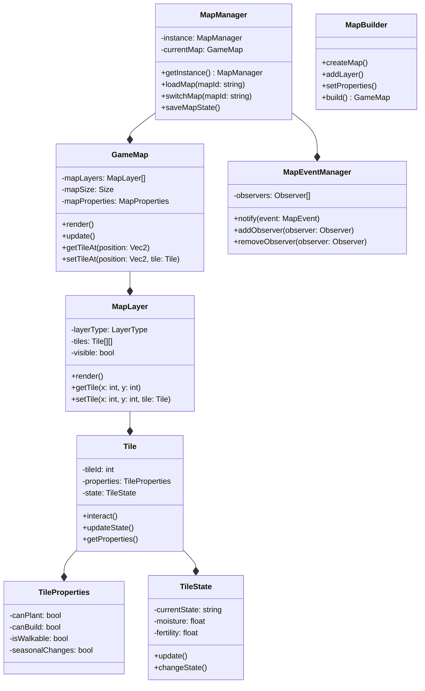

# 地图系统设计方案

1. 适用的设计模式：
- 单例模式：用于地图管理器，确保全局只有一个地图系统实例
- 观察者模式：处理地图事件通知(如季节变化、天气变化等)
- 建造者模式：用于构建不同类型的地图场景
- 状态模式：管理地块的不同状态(如土地的耕种状态)
- 命令模式：处理地图编辑操作(如开垦土地)

2. 核心功能点(按实现优先级排序)：
```
基础框架：
- 地图加载与渲染
- 多层级管理(地形层、建筑层、装饰层等)
- 地图数据持久化
- 地块属性系统

核心功能：
- 地块交互系统(开垦、浇水等)
- 建筑系统(放置、移除)
- 碰撞检测
- 场景切换(室内外转换)

扩展功能：
- 地图编辑器
- 季节与天气系统
- 寻路系统
- NPC路径规划
```

3. 类设计：




文件结构建议：
```
map/
├── core/
│   ├── MapManager.h/.cpp
│   ├── GameMap.h/.cpp
│   ├── MapLayer.h/.cpp
│   └── Tile.h/.cpp
├── builder/
│   └── MapBuilder.h/.cpp
├── state/
│   └── TileState.h/.cpp
├── properties/
│   ├── MapProperties.h/.cpp
│   └── TileProperties.h/.cpp
├── events/
│   └── MapEventManager.h/.cpp
└── utils/
    ├── MapConstants.h
    └── MapUtils.h/.cpp
```

建议实现顺序：
1. 先实现基础的地图加载和渲染(MapManager, GameMap, MapLayer)
2. 实现基础的地块系统(Tile, TileProperties)
3. 添加地图事件系统
4. 实现地块状态系统
5. 添加建筑系统
6. 实现季节和天气效果
